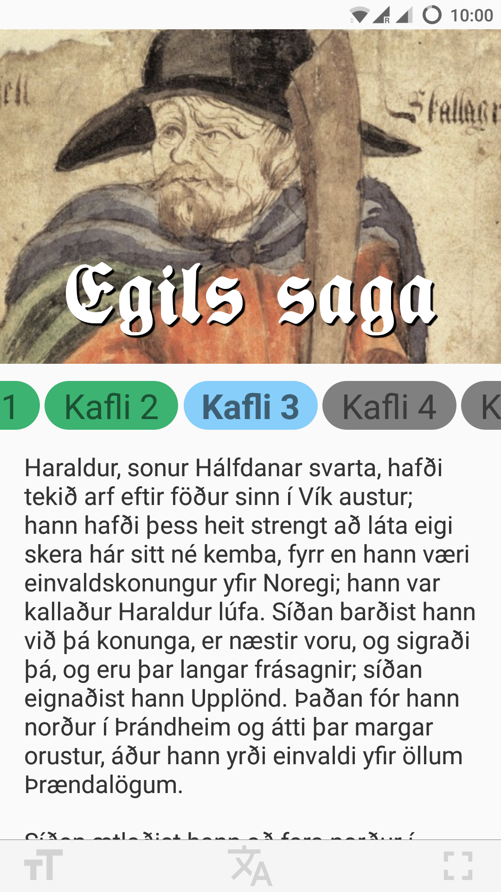

# Egla / Egils saga

Með þessu appi er hægt að lesa Egils sögu á íslensku, fornnorrænu og ensku.

Hægt er að nálgast appið á [Google Play](https://play.google.com/store/apps/details?id=com.egla).



## Kröfur

1. [Node](https://nodejs.org/)
2. [npm](https://npmjs.com/)

## Uppsetning

1. **Sæktu kóðann**:

  ```
  $ git clone https://github.com/svngr/egla.git
  $ cd egla
  ```

2. **Settu upp nauðsynlega pakka**:

  ```
  $ npm install
  ```

3. **Keyrðu appið á Android**:

  ```
  $ react-native run-android
  $ adb reverse tcp:8081 tcp:8081
  ```

## Vandamál

> Could not connect to development server

Opnaðu nýjan terminal-glugga og keyrðu eftirfarandi skipun:

  ```
  $ react-native start
  ```
